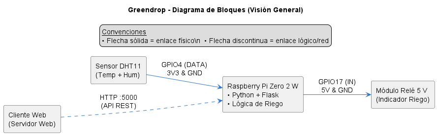
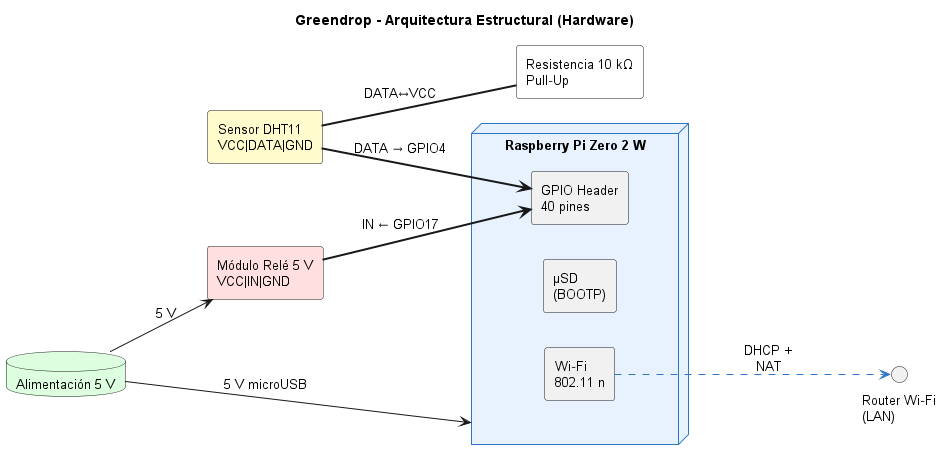
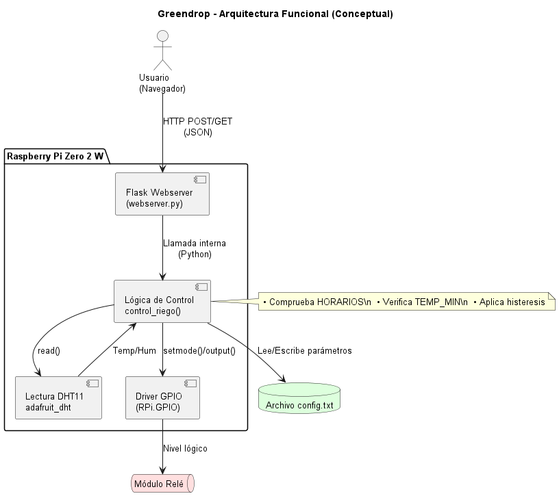

# 🌱 GreenDrop: Sistema inteligente de riego automatizado

📚 Proyecto académico  
**Universidad Nacional de Colombia – Sede Manizales**  
Facultad de Ingeniería y Arquitectura  
Asignatura: **Programación en Sistemas Linux Embebidos**  
Periodo: 2025-1

---

👤 Autores

- 🎓 Julián Alberto Hidalgo Flórez  
  - GitHub: [@julianhidalgo10](https://github.com/julianhidalgo10)  
  - Correo: jhidalgof@unal.edu.co

- 🎓 David Santiago Pérez  
  - GitHub: [@DavSanp](https://github.com/DavSanp)  
  - Correo: dperezgo@unal.edu.co

---

## 📘 1. Descripción

GreenDrop es un sistema embebido que permite automatizar el riego en pequeños cultivos o jardines domésticos mediante un sensor de temperatura y humedad, controlado por una Raspberry Pi Zero 2 W. Integra lectura del sensor DHT11, activación de un actuador (relay), lógica de control programada en python y una API web ligera para monitoreo y configuración desde un servidor web.

Este proyecto fue desarrollado bajo Linux embebido y sigue las buenas prácticas para construcción modular, con componentes reutilizables, extensibles y documentados.

---

## 🧱 2. Diagrama de bloques

Representación general del sistema:



---

## 🧩 3. Arquitectura estructural (hardware)

El sistema está compuesto por los siguientes elementos físicos:



- 🧠 Raspberry Pi Zero 2 W (computadora central)  
- 🌡️ Sensor DHT11: lectura de temperatura y humedad  
- 🔌 Relay de 5V: controla sistema de riego (indicador o bomba)  
- ⚡ Fuente 5V/2A: alimentación  
- 🧰 Conexiones GPIO  
- 💻 Conexión SSH / UART para acceso remoto  

---

## 🧠 4. Arquitectura funcional (conceptual)

Describe el flujo de funcionamiento lógico del sistema:



---

## ⚙️ 5. Estructura del proyecto

```
Greendrop/
├── config/                              # Configuración del sistema
│ └── config.txt
├── data/                                # Logs y CSV (se generan en runtime)
├── img/                                 # Diagramas PNG
│ ├── Diagrama_bloques.png
│ ├── arquitectura_estructural.png
│ └── arquitectura_funcional.png
├── scripts/                             # Scripts de utilidad (servicios)
├── src/                                 # Código fuente principal
│ └── webserver.py
├── requirements.txt                     # Dependencias del sistema
├── LICENSE                              # Licencia MIT 
├── Makefile                             # Automatización de tareas
└── README.md                            # Este documento
```

---

## 🧪 6. Pruebas del sistema y validaciones

Pruebas realizadas por fases:

### ✅ Fase 1 – Comunicación Serial
- Se habilitó el puerto serial UART en la Raspberry Pi.
- Se estableció conexión desde Ubuntu host mediante picocom:
  ```bash
  sudo picocom -b 115200 /dev/ttyUSB0
  ```
### ✅ Fase 2 - Lectura del sensor DHT11
- Lectura en terminal con Adafruit CircuitPython + Blinka
- Validación de humedad y temperatura con script Python

### ✅ Fase 3 - Activación de relay  
- Se conectó el relay a GPIO17 (pin 11).
- Se activó manualmente mediante GPIO.output para validar funcionamiento.

### ✅ Fase 4 – Lógica de control inteligente (humedad, temperatura y horario)
- Control automático basado en condiciones:
    ```
    Si humedad < 40% y temperatura > 10°C → Activa riego
    Si humedad > 55% → Desactiva riego
    Solo se permite riego entre 6:00–9:00 y 18:00–21:00
    ```
### Fase 5 – Interfaz Web API REST
- API con Flask expuesta en el puerto 5000:
    ```
    POST /api/riego
    GET /api/status
    POST /api/configuracion
    ```

---

## 🔧 7. Instalación y uso

### ⚙️ Requisitos

- Raspberry Pi Zero 2 W  
- Sensor DHT11 conectado a GPIO4  
- Relay en GPIO17  
- Raspberry Pi OS actualizado  

### 📦 Instalación del entorno

```bash
sudo apt update && sudo apt upgrade
sudo apt install python3-pip python3-venv libgpiod-dev

# Crear un entorno virtual
python3 -m venv venv
source venv/bin/activate

# Instalar dependencias
pip install -r requirements.txt
```

🚀 Ejecución manual
```
cd src/
python3 webserver.py
```

Desde tu navegador visita:
`http://<IP_RASPBERRY>:5000/`

---

## 🌐 8. Endpoints API

```
| Método | Ruta               | Descripción                               |
| ------ | ------------------ | ----------------------------------------- |
| POST   | /api/riego         | Activar o desactivar manualmente el riego |
| GET    | /api/status        | Obtener estado del sistema de riego       |
| POST   | /api/configuracion | Actualizar umbral, hora y duración        |
```

## 🛠️ 9. Automatización con systemd

Para que el sistema arranque automáticamente:
`Archivo: /etc/systemd/system/greendrop.service`

```
[Unit]
Description=GreenDrop Webserver
After=multi-user.target

[Service]
User=user
WorkingDirectory=/home/user/Greendrop/src
ExecStart=/home/user/dht11_env/bin/python3 webserver.py
Restart=always

[Install]
WantedBy=multi-user.target
```

Habilitar con:

```
sudo systemctl daemon-reexec
sudo systemctl daemon-reload
sudo systemctl enable greendrop
sudo systemctl start greendrop
```

## 🧯 10. Problemas encontrados y soluciones

```
| Problema                                      | Solución                                                |
| --------------------------------------------- | ------------------------------------------------------- |
| pip3 install Adafruit\_DHT → error de entorno | Crear entorno virtual y usar --break-system-packages    |
| Relay no activaba                             | Verificar conexión a 5V y usar GND directo desde RPi    |
| No carga Flask                                | pip install flask dentro del entorno virtual            |
| DHT11 no lee                                  | Esperar unos segundos antes de lectura o cambiar sensor |
```

---

## 🧭 11. Guía de uso automático y manual

### 🟢 USO NORMAL (AUTOMÁTICO, “PLUG AND PLAY”)
1. Conecta la Raspberry Pi Zero 2 W a la corriente y a la red WiFi o cableada.
2. Espera a que arranque completamente (unos 30-60 segundos).
3. Desde cualquier dispositivo conectado a la misma red:
    Abre el navegador.
    Ingresa la dirección IP de la Raspberry Pi Zero 2 W, por ejemplo: `http://192.168.1.40:5000/`
    (Cambia la IP por la real de la Raspberry Pi Zero 2 W, se puede consultar con `hostname -I` si tienes monitor, o desde el router)
4. Se verá el dashboard de GreenDrop funcionando correctamente. No se necesita hacer nada más en la Raspberry PI Zero 2 W.

### 🟠 INICIO MANUAL (en caso de emergencia o mantenimiento)

```
ssh user@<ip_raspberry>
cd ~/GreenDrop
source venv/bin/activate
python src/webserver.py
```

Si todo está bien, se verá algo como:

```
 * Serving Flask app 'webserver'
 * Running on http://0.0.0.0:5000/
```

### 🟣 SI SE QUIERE VOLVER AL INICIO AUTOMÁTICO

```
sudo reboot
```

El servicio GreenDrop se ejecutará automáticamente al arrancar. No es necesario volver a hacer los pasos manuales.

---

## 🎓 12. Conclusión

GreenDrop es una solución embebida funcional, extensible y educativa. Permite implementar control ambiental inteligente, aprovechando el ecosistema Linux y Python en la Raspberry Pi Zero 2 W. Cumple con los objetivos propuestos de automatización, monitoreo y control.

---

## ⚖️ Licencia y Créditos

Este proyecto ha sido desarrollado con fines académicos en el marco de la Universidad Nacional de Colombia, y está licenciado bajo la MIT License. Consulta el archivo [LICENSE](LICENSE) para más detalles.

💡 Todos los recursos, códigos, imágenes y documentación han sido desarrollados por los autores con fines académicos y demostrativos.

🚫 No se permite su distribución comercial sin autorización explícita de los autores.

© 2025 Julián Alberto Hidalgo Flórez & David Santiago Pérez — Universidad Nacional de Colombia

---